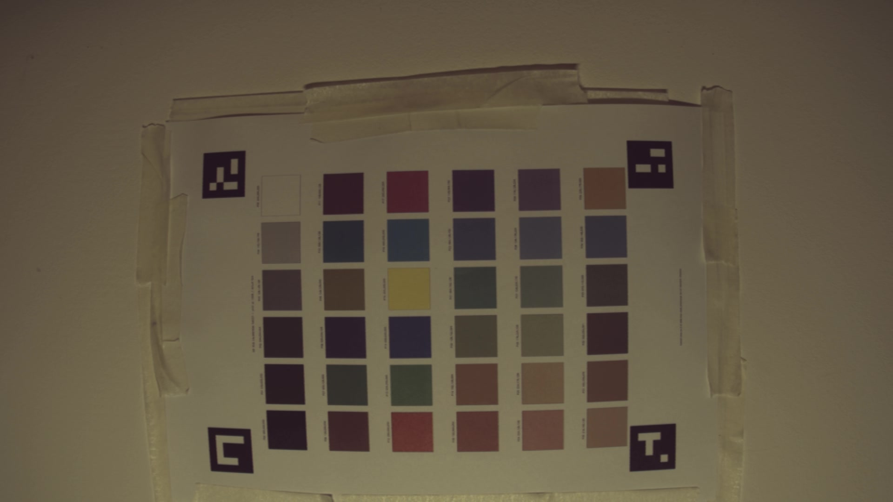
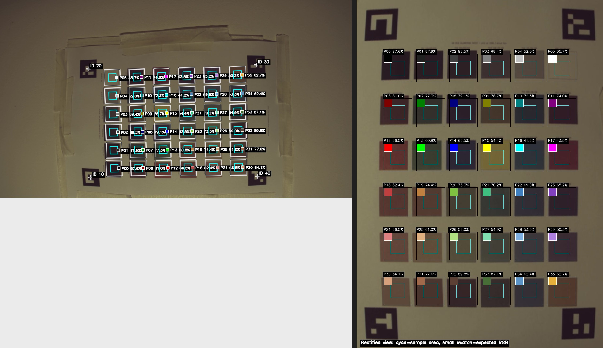

# Radxa Cubie A7S IMX477 bring-up

This repository is a bring-up snapshot for an Arducam B0242 / Sony IMX477
camera on the Radxa Cubie A7S (Allwinner A733).

The current driver produces coherent 1920x1080 and 3840x2160 NV12 frames from
four-lane RAW10 sensor streams. The UHD mode uses a centered sensor-side crop
of 108 pixels per horizontal edge and 440 per vertical edge. Capture uses
the A733's paired TDM/ISP large-image path. This is not yet a production-quality
camera stack:
the closed Allwinner ISP602 userspace library has no IMX477 tuning profile, so
the image is dark, magenta, and vertically banded.

## Tested platform

- Board: Radxa Cubie A7S / A733
- Camera: Arducam B0242 / Sony IMX477
- Kernel: `5.15.147-21-a733`
- Sensor mode: 1920x1080, RAW10, four CSI-2 lanes, nominal 60 fps
- Capture output: 1920x1080 NV12 on `/dev/video0`; 3840x2160 NV12 on
  `/dev/video1`
- Upstream BSP base: `radxa/allwinner-bsp` commit
  `c8fb29d68c58ae557e8fb96ae829ca2693936a75`

## What is implemented

- IMX477 chip-ID validation.
- 1920x1080 RAW10 four-lane sensor mode.
- 3840x2160 RAW10 four-lane sensor mode, nominal 30 fps. The sensor performs
  the centered crop before transmitting CSI-2 data.
- Discrete V4L2 frame-size enumeration for both sensor modes.
- Paired ISP/TDM large-image capture for the 3840-pixel-wide mode.
- Paired DMA/ISP pipelines are armed before their shared sensor is started,
  keeping the two halves synchronized during UHD capture.
- Per-register sensor-table writes with error reporting and short pacing for
  the A733 TWI controller.
- A VIN workaround that prevents AWISP's 2-in-1 DMA merge request from making
  TDM program half-width 1128x1080 buffers for a 1920x1080 linear stream.
- Runtime TDM configuration logging for bring-up diagnostics.
- Large-image sensor exposure/gain updates are temporarily frozen. The two
  ISP instances otherwise issue updates to the same sensor and trigger A733
  TWI failures during full-frame streaming.
- Device-tree overlay: `dts/cubie-a7a-arducam-imx477.dts`.

## Known limitations

- The first stream after boot currently fails. Stop it and open the camera a
  second time; the retry produces a valid frame.
- Consecutive captures can alternate between about 60 fps and about 30 fps.
  AWISP still announces `STITCH_2IN1_LINNER`; a 30 fps capture is the reliable
  fallback.
- A 180-frame end-to-end sink test completes in about 6.2 seconds, or roughly
  29 fps, through the paired merge path. A 30-frame raw capture has no missing
  pixels in either 1920-pixel half.
- Do not switch directly between the 1920x1080 and 3840x2160 paths. Opening
  `/dev/video1` after a `/dev/video0` capture can hard-lock the current VIN
  stack. Reboot before changing modes; clean-boot full-frame capture is
  repeatable.
- Automatic exposure/gain is disabled only for large-image mode pending
  synchronized sensor control. The mode-table values remain active.
- ISP output is not calibrated. The installed
  `libAWIspApi-isp-602-arm64` package only contains IMX214, IMX219, and IMX415
  profiles. An ISP602 IMX477 profile is still required for correct exposure,
  white balance, black level, color, and lens-shading correction.
- The fallback OV13850 profile enables strong ISP temporal denoising. Prefix
  motion-sensitive capture commands with
  `LD_PRELOAD=/usr/local/lib/libisp_no3dn.so` to bypass the ISP602 D3D stage.
- The DMA-merge workaround is intentionally limited to 1920x1080 and should be
  generalized once the AWISP configuration path is understood.

## Build

On the target board:

```sh
./scripts/imx477/build.sh
```

The build uses the running kernel headers and produces:

```text
drivers/vin/modules/sensor/imx477_mipi.ko
drivers/vin/vin_v4l2.ko
scripts/imx477/libisp_no3dn.so
```

Install with backups, then reboot:

```sh
./scripts/imx477/install.sh
sudo reboot
```

## Capture test

Capture 300 frames to a sink:

```sh
./scripts/imx477/test-300-frames.sh
```

Capture one NV12 frame:

```sh
gst-launch-1.0 -e \
  v4l2src device=/dev/video0 io-mode=2 num-buffers=1 \
  ! 'video/x-raw,format=NV12,width=1920,height=1080,framerate=60/1' \
  ! filesink location=imx477-1920x1080.nv12
```

Each complete NV12 frame is 3,110,400 bytes.

Capture one UHD NV12 image through the paired large-image node:

```sh
./scripts/imx477/test-full-frame.sh imx477-3840x2160.nv12
```

The equivalent pipeline is:

```sh
gst-launch-1.0 -e \
  v4l2src device=/dev/video1 io-mode=2 num-buffers=1 \
  ! 'video/x-raw,format=NV12,width=3840,height=2160,framerate=30/1' \
  ! filesink location=imx477-3840x2160.nv12
```

Each complete UHD NV12 image is 12,441,600 bytes.

### Record and encode a short UHD video

Record 60 uncompressed NV12 frames (nominally two seconds at 30 fps) on the
Cubie A7S. The resulting file is 746,496,000 bytes:

```sh
LD_PRELOAD=/usr/local/lib/libisp_no3dn.so gst-launch-1.0 -e \
  v4l2src device=/dev/video1 io-mode=2 num-buffers=60 \
  ! 'video/x-raw,format=NV12,width=3840,height=2160,framerate=30/1' \
  ! filesink location=imx477-4k-60frames.nv12
```

Copy the recording to a faster machine for encoding:

```sh
scp radxa@192.168.0.41:/home/radxa/imx477-build/imx477-4k-60frames.nv12 .
```

Encode the raw frames as an H.264 MP4 on that machine:

```sh
ffmpeg \
  -f rawvideo \
  -pixel_format nv12 \
  -video_size 3840x2160 \
  -framerate 30 \
  -i imx477-4k-60frames.nv12 \
  -c:v libx264 \
  -preset medium \
  -crf 18 \
  -pix_fmt yuv420p \
  -movflags +faststart \
  imx477-4k-test.mp4
```

The raw file contains no header, so the pixel format, dimensions, and frame
rate must be supplied explicitly when decoding it.

For motion tests and streaming, bypass the fallback profile's temporal filter:

```sh
LD_PRELOAD=/usr/local/lib/libisp_no3dn.so gst-launch-1.0 -e \
  v4l2src device=/dev/video1 io-mode=2 num-buffers=1 \
  ! 'video/x-raw,format=NV12,width=3840,height=2160,framerate=30/1' \
  ! fakesink sync=false
```

The preload hook only changes the ISP602 D3D bypass bit. It does not alter the
sensor mode, frame geometry, exposure, or spatial denoising.

## Installed reference hashes

The tested snapshot used these module hashes:

```text
b75284693ebd905851adb8ad87f03fdcce52b0cc0232b60e52e35888c3a09277  imx477_mipi.ko
8fd7f7afdc7481ba34103f407b97286c94818bfa99b2d070034aec04c5848d03  vin_v4l2.ko
```

The modules are not committed because they are kernel-version-specific and can
be reproduced from source.

## 1080p tone-mix reference capture

The repository also includes a visually realistic processed 1080p reference
capture in [`examples/imx477-1080p-tone-mix-20260824/`](examples/imx477-1080p-tone-mix-20260824/).
It was captured from `/dev/video0` at 1920×1080 with the tone-mix profile,
`force_exp_16line=122880`, and `force_gain_16=16`.

The original frame:



The corresponding debug/evaluation overlay, using automatic ArUco marker
detection:



The machine-readable evaluator output is
[`exp122880-eval.json`](examples/imx477-1080p-tone-mix-20260824/exp122880-eval.json).

## Device snapshot as of 2026-09-19 cleanup

The Cubie A7S this repository was developed on runs kernel
`5.15.147-21-a733` with the following state installed (reproducible from
this branch via `scripts/imx477/install.sh` plus the Arducam overlay):

```text
7d8dafb9db61d115fb076e8831aceda90838626510c37bfea3986ba3fb222c91  /lib/modules/5.15.147-21-a733/extra/imx477_mipi.ko
8fd7f7afdc7481ba34103f407b97286c94818bfa99b2d070034aec04c5848d03  vin_v4l2.ko (uncompressed, matches tested reference above)
3047294de7fa7be12225325f680618a08490e921f82f04bacbe8e240f3f3dc87  /usr/local/lib/libisp_no3dn.so
391852c8abc6251b960b1974ae05f009e97a6fc5a24f2619968c640081734709  /boot/dtbo/cubie-a7a-arducam-imx477.dtbo
```

The loaded `imx477_mipi` module exposes `force_exp_16line`/`force_gain_16`,
i.e. it is built from the committed source at this branch's HEAD. Pre-port
snapshots of the stock VIN stack are kept on the device in
`~/camera-backups/`. ISP tuning assets live under `work/` (scripts tracked,
capture datasets gitignored).
